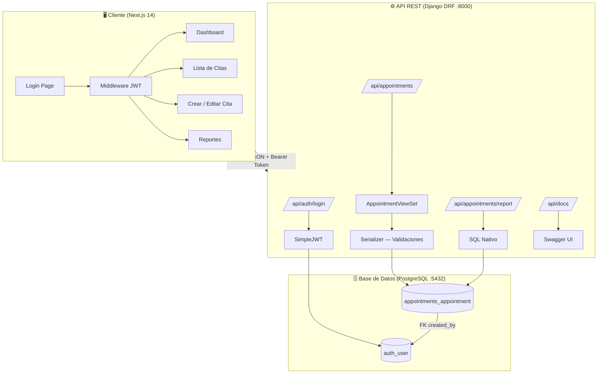
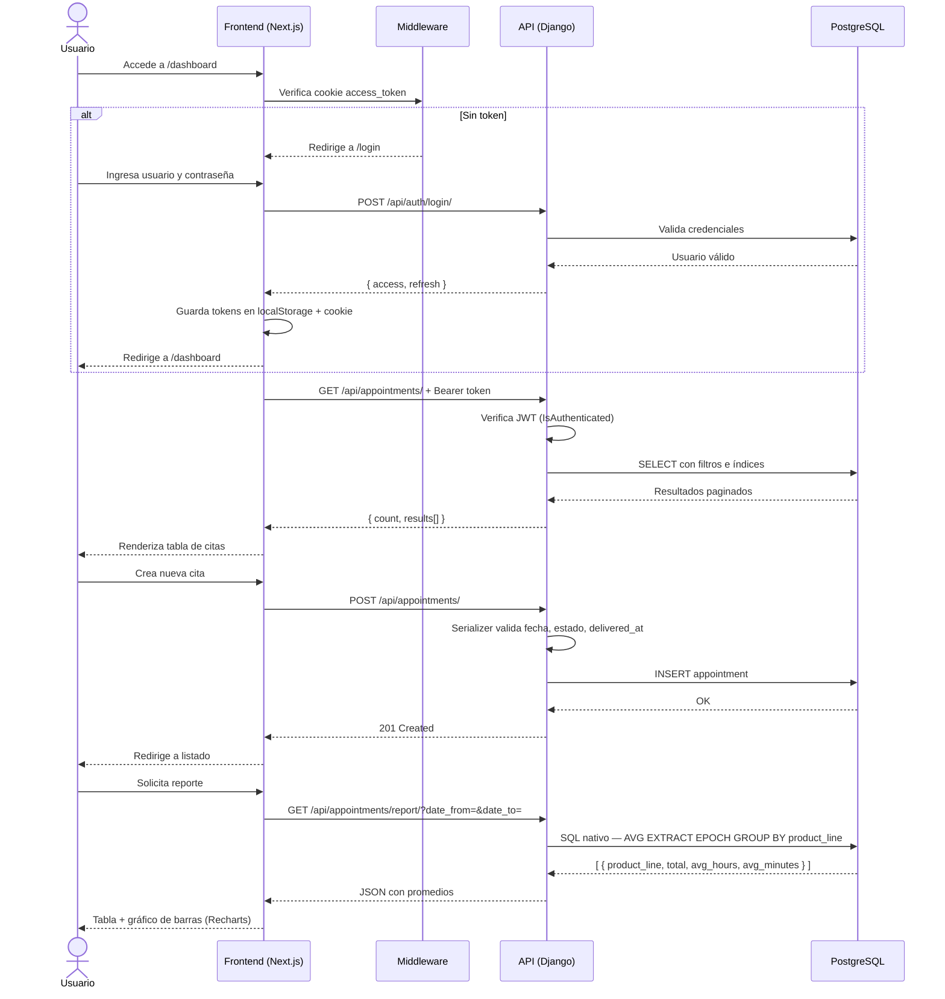

# Sistema de Gestión de Citas de Entrega — Retail Textil

## Descripción General

Aplicación web fullstack para gestionar citas de entrega de mercancía en una empresa de retail textil. Permite registrar, listar, actualizar y cancelar citas, y genera reportes de tiempo promedio de entrega por sublínea usando SQL nativo.

---

## 📂 Estructura Actual (Layered)

```bash
sistema-de-gestión-de-citas-de-entrega/
├── backend/                        # Capa de negocio y datos
│   ├── apps/
│   │   ├── authentication/         # Autenticación JWT
│   │   │   ├── views.py            # LoginView, LogoutView
│   │   │   └── urls.py
│   │   └── appointments/           # Dominio principal
│   │       ├── models.py           # Modelo Appointment (UUID, choices, índices)
│   │       ├── serializers.py      # Validaciones de negocio
│   │       ├── views.py            # CRUD + reporte SQL nativo
│   │       ├── urls.py
│   │       ├── tests.py            # 5 pruebas unitarias
│   │       ├── migrations/
│   │       └── management/
│   │           └── commands/
│   │               └── seed_data.py
│   ├── core/
│   │   ├── settings.py             # Configuración central
│   │   ├── urls.py                 # Rutas raíz + Swagger
│   │   └── wsgi.py
│   ├── requirements.txt
│   ├── Dockerfile
│   ├── entrypoint.sh               # migrate + seed + runserver
│   └── .flake8
│
├── frontend/                       # Capa de presentación
│   └── src/
│       ├── app/
│       │   ├── layout.tsx          # Layout raíz con Inter font
│       │   ├── page.tsx            # Dashboard
│       │   ├── login/page.tsx      # Login con JWT
│       │   ├── appointments/
│       │   │   ├── page.tsx        # Listado + filtros + paginación
│       │   │   ├── new/page.tsx    # Crear cita
│       │   │   └── [id]/edit/      # Editar cita
│       │   ├── reports/page.tsx    # Reporte + gráfico Recharts
│       │   └── components/
│       │       ├── AppShell.tsx    # Layout con sidebar responsive
│       │       ├── Sidebar.tsx     # Navegación lateral
│       │       └── AppointmentForm.tsx
│       ├── lib/
│       │   └── api.ts              # Axios + interceptores JWT
│       └── middleware.ts           # Protección de rutas Next.js
│
├── docker-compose.yml              # PostgreSQL + backend + frontend
├── .env.example
└── README.md
```

---

## 🏗️ Diagrama de Arquitectura



---

## 🔄 El flujo de la app



---

## Diagrama Entidad-Relación

```
[ auth_user ]           [ appointments_appointment ]
  id (PK)        1──N    id (UUID, PK)
  username                scheduled_at (DateTime)
  password                supplier (A | B | C)
  email                   product_line (Camisetas | Pantalones | Zapatos | Accesorios)
                          status (Programada | En proceso | Entregada | Cancelada)
                          delivered_at (DateTime, nullable)
                          observations (Text, nullable)
                          created_by (FK → auth_user)
                          created_at (DateTime, auto)
                          updated_at (DateTime, auto)
```

---

## Stack Tecnológico

- Backend: Django 4.2, Django REST Framework, SimpleJWT, drf-spectacular, django-filter
- Frontend: Next.js 14 (App Router), TypeScript, Tailwind CSS, Axios, Recharts
- Base de datos: PostgreSQL 15
- Infraestructura: Docker, Docker Compose

---

## Instalación y Ejecución

### Con Docker (recomendado)

```bash
# 1. Clonar el repositorio
git clone <repo-url>
cd sistema-de-gestión-de-citas-de-entrega

# 2. Copiar variables de entorno
cp .env.example .env

# 3. Levantar todo con un solo comando
docker-compose up --build
```

La app estará disponible en:
- Frontend: http://localhost:3000
- Backend API: http://localhost:8000/api/
- Swagger UI: http://localhost:8000/api/docs/

El entrypoint del backend corre automáticamente:
1. Espera a que PostgreSQL esté listo
2. Aplica migraciones (`migrate`)
3. Crea usuarios y 20 citas de prueba (`seed_data`)
4. Inicia el servidor

### Sin Docker

**Backend:**
```bash
cd backend
python -m venv venv
source venv/bin/activate  # Windows: venv\Scripts\activate
pip install -r requirements.txt
# Configurar variables de entorno (ver .env.example)
python manage.py migrate
python manage.py seed_data
python manage.py runserver
```

**Frontend:**
```bash
cd frontend
npm install
npm run dev
```

---

## Variables de Entorno

Ver `.env.example` para la lista completa. Variables requeridas:

| Variable | Descripción |
|---|---|
| `SECRET_KEY` | Clave secreta de Django |
| `DEBUG` | `True` para desarrollo |
| `DB_NAME` | Nombre de la base de datos |
| `DB_USER` | Usuario de PostgreSQL |
| `DB_PASSWORD` | Contraseña de PostgreSQL |
| `DB_HOST` | Host de PostgreSQL (usar `db` en Docker) |
| `DB_PORT` | Puerto de PostgreSQL (5432) |
| `NEXT_PUBLIC_API_URL` | URL base de la API para el frontend |

---

## Credenciales de Prueba

Creadas automáticamente por `seed_data`:

| Usuario | Contraseña | Rol |
|---|---|---|
| `admin` | `Admin2024!` | Superusuario |
| `operador1` | `Operador2024!` | Operador |
| `operador2` | `Operador2024!` | Operador |

---

## Documentación de la API

- Swagger UI: http://localhost:8000/api/docs/
- Redoc: http://localhost:8000/api/redoc/

Endpoints principales:

| Método | Endpoint | Descripción |
|---|---|---|
| POST | `/api/auth/login/` | Login — retorna access + refresh token |
| POST | `/api/auth/logout/` | Logout |
| POST | `/api/auth/token/refresh/` | Renovar access token |
| GET | `/api/appointments/` | Listar citas (filtros + paginación) |
| POST | `/api/appointments/` | Crear cita |
| GET | `/api/appointments/{id}/` | Detalle de cita |
| PATCH | `/api/appointments/{id}/` | Actualizar cita |
| GET | `/api/appointments/report/` | Reporte SQL nativo por sublínea |

---

## Cómo Correr las Pruebas

```bash
# Con Docker
docker-compose exec backend python manage.py test apps.appointments

# Sin Docker (desde /backend con venv activo)
python manage.py test apps.appointments

# Con pytest
pytest
```

Los tests cubren:
- Cita no puede crearse con fecha en el pasado
- Estado `Entregada` requiere `delivered_at`
- Transición `Entregada → Programada` no permitida
- Usuario no autenticado recibe 401
- Endpoint de reporte retorna campos esperados

---

## Decisiones Técnicas

**JWT sobre Session Auth:** Elegido por su naturaleza stateless, ideal para SPAs y Next.js. Permite escalar horizontalmente sin compartir estado de sesión entre instancias.

**Next.js App Router:** Middleware nativo para protección de rutas, Server Components para SEO, y estructura de carpetas que refleja las rutas directamente.

**SQL nativo para reportes:** El requerimiento lo exige explícitamente. Se usa `EXTRACT(EPOCH FROM ...)` de PostgreSQL para calcular diferencias de tiempo con precisión, más eficiente que hacerlo en Python.

**django-filter:** Permite filtros declarativos con lookups `__gte`/`__lte` para rangos de fecha sin escribir queries manuales.

**Índices en BD:** `scheduled_at`, `supplier`, `product_line` y `status` están indexados porque son los campos de filtrado más frecuentes según los requerimientos.

---

## Supuestos

- El campo `supplier` almacena solo la letra (A, B, C) por eficiencia; el frontend muestra "Proveedor A/B/C".
- La cancelación es un cambio de estado, no eliminación física del registro.
- El reporte filtra por `scheduled_at` (fecha programada), no por `delivered_at`.
- En desarrollo, `CORS_ALLOW_ALL_ORIGINS = True`. En producción debe restringirse.
